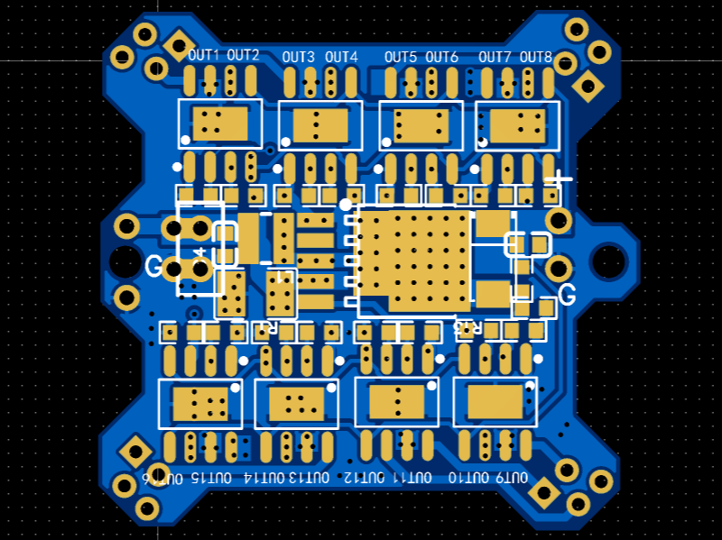
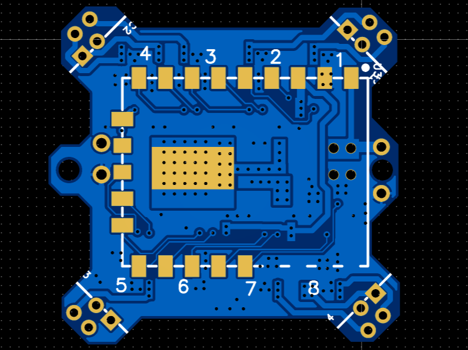
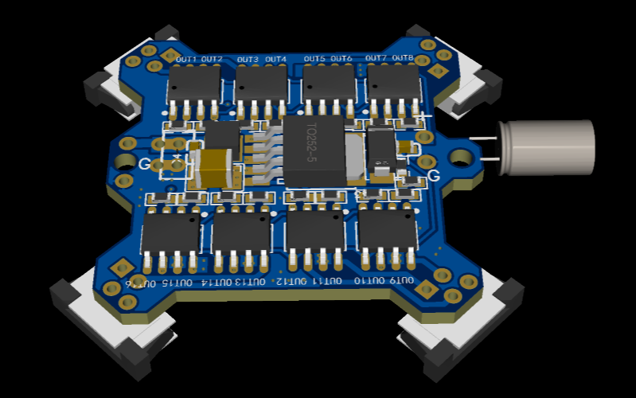
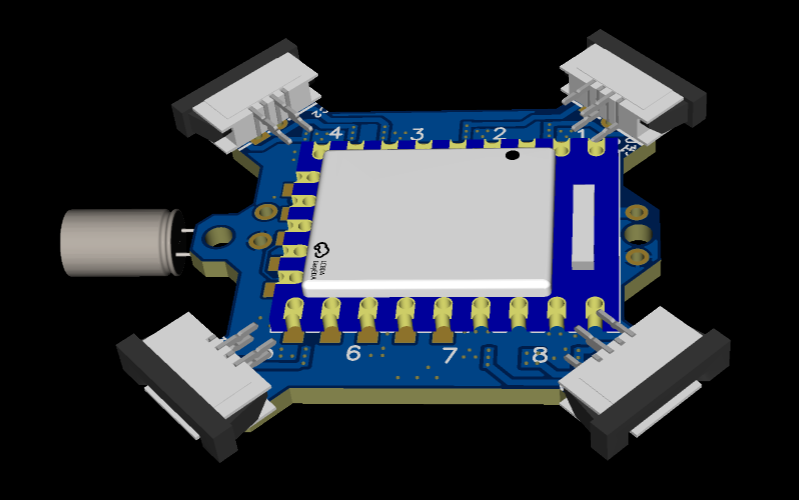

# EPM Control Board

This repository contains the design files for the EPM (Electric Permanent Magnet) Control Board, designed for controlling 8 electric permanent magnet modules. The board is optimized for compact, low-power applications, enabling precise control of EPM states for various configurations.

## Overview

The EPM Control Board is a lightweight (7.1g) PCB designed to manage the state and current direction of 8 EPM units. Key hardware components include:

- **8 H-bridge drivers** (AS4950, ASSEMSTAR Technology) for individual EPM control.
- **180µF capacitor bank** for rapid EPM switching.
- **DC/DC converter** (XL6008E1, XLSEMI Technology) to step up 3.7V battery voltage to 30V.
- **ESP32-S3R8 microcontroller** (waveshare ESP32-S3-Tiny) for control logic and communication.

The design is compatible with the Crazyflie flight control system and supports modular integration for coordinated operations.

## Directory Structure

| File/Folder           | Description                                                  |
| :-------------------- | :----------------------------------------------------------- |
| 3D Model              | Contains a `.step` file for the PCB. Exported from EasyEDA Pro. |
| gerber.zip            | PCB gerber file.                                             |
| images                | Images to show what the PCB should look like.                |
| src                   | `.epro` file for EasyEDA Pro. .  `.ino` file for ESP32(Arduino). |
| Schematic_EPM_PCB.pdf | PCB schematic `.pdf` file.                                   |

## PCB Images

### 2D Views

### 3D Views

## Using the Design Files

The PCB was designed using **EasyEDA Pro Edition (Free)**. To import the project:

1. Open EasyEDA Pro.
2. Navigate to **File > Import > EasyEDA (Professional)**.
3. Select the `.epro` file from the `src` folder.
4. Click **Open**.

## License

This project is licensed under the MIT License. See the [LICENSE](LICENSE) file for details.

## Contributing

Contributions are welcome! Please submit a pull request or open an issue for any improvements or suggestions.
